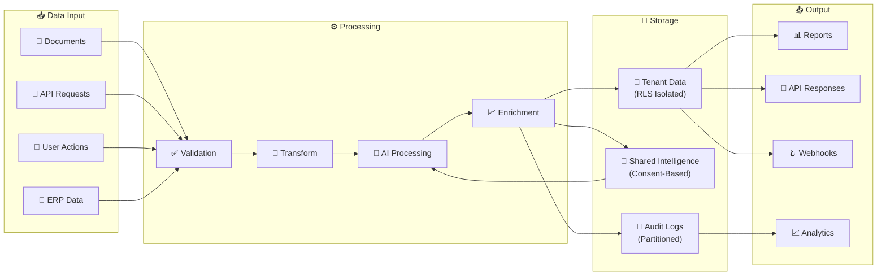
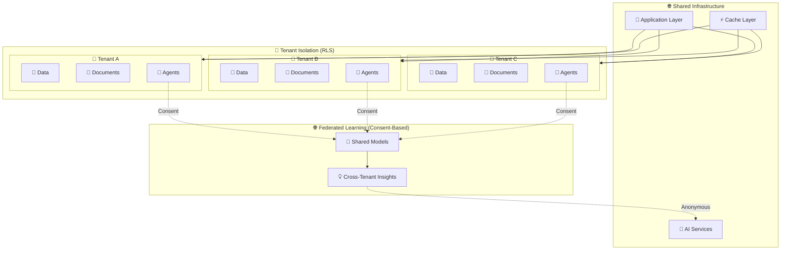
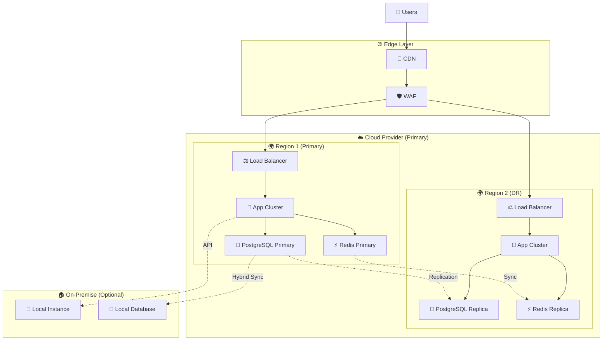
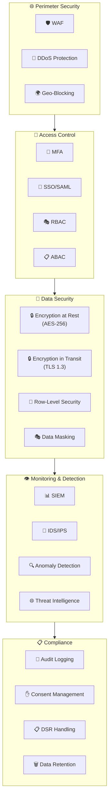
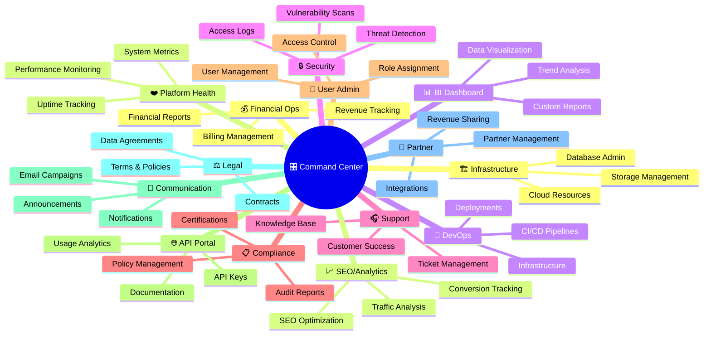
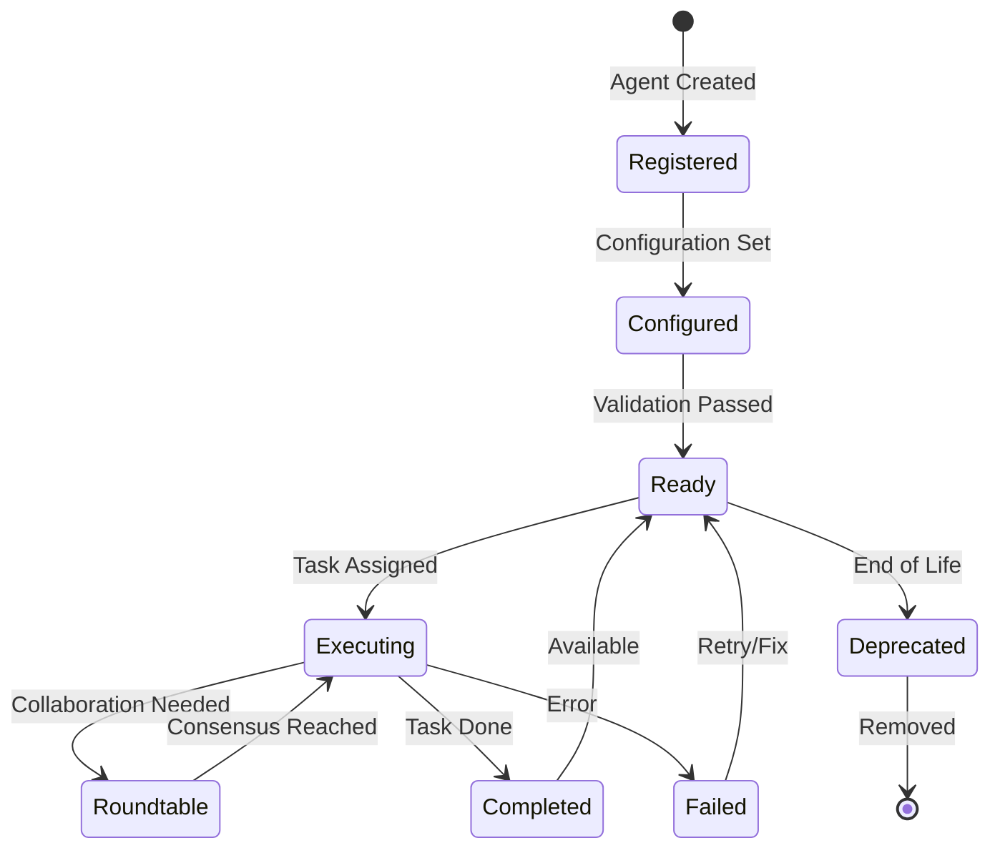

# FinACEverse Architecture Diagram

## 🏗️ Complete Platform Architecture

```mermaid
flowchart TB
    subgraph CLIENTS["🌐 Client Layer"]
        WEB["🖥️ Web App<br/>(React)"]
        MOBILE["📱 Mobile Apps<br/>(iOS/Android)"]
        API_CLIENT["🔌 API Clients<br/>(Partners/Integrations)"]
        EMBED["🧩 Embedded Widgets"]
    end

    subgraph GATEWAY["🚪 API Gateway & Security"]
        LB["⚖️ Load Balancer"]
        WAF["🛡️ WAF / DDoS Protection"]
        AUTH["🔐 Authentication<br/>(JWT/SSO/MFA)"]
        RATE["⏱️ Rate Limiting"]
        API_GW["🚀 API Gateway"]
    end

    subgraph IDENTITY["👤 Identity & Access Management"]
        TENANT["🏢 Tenant Service"]
        USER["👥 User Management"]
        ROLE["🎭 Roles & Permissions"]
        SSO["🔑 SSO Integration<br/>(SAML/OIDC)"]
        APIKEY["🗝️ API Key Management"]
    end

    subgraph PRODUCTS["📦 Modular Product Engines"]
        subgraph VAMN_BOX["VAMN"]
            VAMN["💎 VAMN Engine<br/>Triple-Stream Valuation"]
        end
        subgraph ACCUTE_BOX["Accute"]
            ACCUTE["⏰ Accute Engine<br/>Practice Management"]
        end
        subgraph CYLOID_BOX["Cyloid"]
            CYLOID["📄 Cyloid Engine<br/>Document Intelligence"]
        end
        subgraph LUCA_BOX["Luca AI"]
            LUCA["🤖 Luca AI Engine<br/>36+ Finance Agents"]
        end
        subgraph FINAID_BOX["Fin(Ai)d Hub"]
            FINAID["🏭 Agent Factory<br/>UDI & ERP Connectors"]
        end
        subgraph FINORY_BOX["Finory"]
            FINORY["📊 Finory Engine<br/>ERP & Journal Entries"]
        end
        subgraph EPIQ_BOX["EPI-Q"]
            EPIQ["⚙️ EPI-Q Engine<br/>Process Mining & BPMN"]
        end
        subgraph SUMBUDDY_BOX["SumBuddy"]
            SUMBUDDY["🛒 SumBuddy Engine<br/>Marketplace"]
        end
    end

    subgraph COMMAND["🎛️ Command Center (14 Modules)"]
        CC1["💰 Financial Ops"]
        CC2["❤️ Platform Health"]
        CC3["🔧 DevOps"]
        CC4["🔒 Security"]
        CC5["🎧 Support"]
        CC6["📋 Compliance"]
        CC7["👤 User Admin"]
        CC8["🌐 API Portal"]
        CC9["📨 Communication"]
        CC10["⚖️ Legal"]
        CC11["🤝 Partner"]
        CC12["🏗️ Infrastructure"]
        CC13["📈 SEO/Analytics"]
        CC14["📊 BI Dashboard"]
    end

    subgraph AI_LAYER["🧠 AI & Federated Learning"]
        AGENT_REG["📝 Agent Registry"]
        AGENT_EXEC["⚡ Agent Executions"]
        ROUNDTABLE["🪑 AI Roundtables"]
        FED_CLUSTER["🌐 Federated Clusters"]
        FED_NODES["📡 Federated Nodes"]
        MODEL_SHARE["🔄 Model Sharing"]
        SEMANTIC["🔍 Semantic Search<br/>(pgvector)"]
    end

    subgraph DATA["💾 Data & Analytics Layer"]
        subgraph PG["🐘 PostgreSQL (Multi-Tenant)"]
            RLS["🔐 Row-Level Security"]
            PARTITION["📦 Partitioned Tables"]
            MATVIEW["📊 Materialized Views"]
            TSVECTOR["📝 Full-Text Search"]
            PGVECTOR["🧮 Vector Search"]
        end
        REDIS["⚡ Redis Cache"]
        S3["☁️ Object Storage<br/>(Documents/Files)"]
        ELASTIC["🔎 Elasticsearch<br/>(Logs/Search)"]
    end

    subgraph COMPLIANCE["🛡️ Security & Compliance"]
        SOC2["✅ SOC 2"]
        GDPR["🇪🇺 GDPR"]
        HIPAA["🏥 HIPAA"]
        AUDIT["📜 Audit Logs"]
        ENCRYPT["🔒 Encryption<br/>(AES-256)"]
        THREAT["🚨 Threat Detection"]
        VULN["🔍 Vulnerability Scans"]
        CONSENT["✋ Consent Management"]
        DSR["📋 Data Subject Requests"]
    end

    subgraph DEVOPS["🔧 Extensibility & DevOps"]
        FLAGS["🚩 Feature Flags"]
        WEBHOOKS["🪝 Webhooks"]
        JOBS["⏰ Scheduled Jobs"]
        CUSTOM["🧩 Custom Modules"]
        PARTNER_INT["🤝 Partner Integrations"]
    end

    subgraph DEPLOY["☁️ Deployment Options"]
        SAAS["☁️ SaaS<br/>(Multi-Tenant)"]
        ONPREM["🏠 On-Premise"]
        HYBRID["🌐 Hybrid<br/>(Multi-Cloud)"]
    end

    %% Client Connections
    WEB --> LB
    MOBILE --> LB
    API_CLIENT --> LB
    EMBED --> LB

    %% Gateway Flow
    LB --> WAF
    WAF --> AUTH
    AUTH --> RATE
    RATE --> API_GW

    %% Gateway to Services
    API_GW --> IDENTITY
    API_GW --> PRODUCTS
    API_GW --> COMMAND
    API_GW --> AI_LAYER

    %% Identity Connections
    TENANT --> RLS
    USER --> ROLE
    SSO --> AUTH
    APIKEY --> API_GW

    %% Products to Data
    VAMN --> PG
    ACCUTE --> PG
    CYLOID --> PG
    CYLOID --> S3
    LUCA --> PG
    LUCA --> AI_LAYER
    FINAID --> PG
    FINAID --> AI_LAYER
    FINORY --> PG
    EPIQ --> PG
    SUMBUDDY --> PG

    %% Command Center Connections
    CC1 --> PG
    CC2 --> ELASTIC
    CC3 --> DEVOPS
    CC4 --> COMPLIANCE
    CC5 --> PG
    CC6 --> COMPLIANCE
    CC13 --> MATVIEW
    CC14 --> MATVIEW

    %% AI Layer Connections
    AGENT_REG --> AGENT_EXEC
    AGENT_EXEC --> ROUNDTABLE
    FED_CLUSTER --> FED_NODES
    FED_NODES --> MODEL_SHARE
    SEMANTIC --> PGVECTOR

    %% Data Layer Internal
    PARTITION --> MATVIEW
    TSVECTOR --> PG
    PGVECTOR --> PG

    %% Compliance Connections
    AUDIT --> PARTITION
    CONSENT --> DSR
    THREAT --> ELASTIC

    %% DevOps Connections
    FLAGS --> PRODUCTS
    WEBHOOKS --> API_GW
    JOBS --> PG

    %% Deployment
    PG --> DEPLOY
    REDIS --> DEPLOY
    S3 --> DEPLOY

    classDef client fill:#e1f5fe,stroke:#01579b
    classDef gateway fill:#fff3e0,stroke:#e65100
    classDef identity fill:#f3e5f5,stroke:#7b1fa2
    classDef product fill:#e8f5e9,stroke:#2e7d32
    classDef command fill:#fce4ec,stroke:#c2185b
    classDef ai fill:#e3f2fd,stroke:#1565c0
    classDef data fill:#fff8e1,stroke:#f57f17
    classDef compliance fill:#ffebee,stroke:#c62828
    classDef devops fill:#e0f2f1,stroke:#00695c
    classDef deploy fill:#f5f5f5,stroke:#424242

    class WEB,MOBILE,API_CLIENT,EMBED client
    class LB,WAF,AUTH,RATE,API_GW gateway
    class TENANT,USER,ROLE,SSO,APIKEY identity
    class VAMN,ACCUTE,CYLOID,LUCA,FINAID,FINORY,EPIQ,SUMBUDDY product
    class CC1,CC2,CC3,CC4,CC5,CC6,CC7,CC8,CC9,CC10,CC11,CC12,CC13,CC14 command
    class AGENT_REG,AGENT_EXEC,ROUNDTABLE,FED_CLUSTER,FED_NODES,MODEL_SHARE,SEMANTIC ai
    class RLS,PARTITION,MATVIEW,TSVECTOR,PGVECTOR,REDIS,S3,ELASTIC data
    class SOC2,GDPR,HIPAA,AUDIT,ENCRYPT,THREAT,VULN,CONSENT,DSR compliance
    class FLAGS,WEBHOOKS,JOBS,CUSTOM,PARTNER_INT devops
    class SAAS,ONPREM,HYBRID deploy
```

---

## 📊 Data Flow Diagram

---

## 🏢 Multi-Tenant Isolation Model

---

## 🚀 Deployment Topology

---

## 📋 Product Engine Matrix

| Product | Core Function | AI Features | Data Store | Key Integrations |
|---------|--------------|-------------|------------|------------------|
| **VAMN** | Triple-stream valuation | Verification AI | PostgreSQL + Audit | Accute, Finory |
| **Accute** | Practice management | AI Roundtable | PostgreSQL | Luca AI, VAMN |
| **Cyloid** | Document intelligence | 3-way matching, Fact Graph | PostgreSQL + S3 | All products |
| **Luca AI** | Conversational finance | 36+ agents, Tax research | PostgreSQL + Vector | All products |
| **Fin(Ai)d Hub** | Agent factory | UDI, Custom agents | PostgreSQL | ERP systems |
| **Finory** | ERP integration | Zero-fallback protocol | PostgreSQL | External ERPs |
| **EPI-Q** | Process mining | Digital twin, PMQL | PostgreSQL | All products |
| **SumBuddy** | Marketplace | Provider matching | PostgreSQL | Partners |

---

## 🔐 Security Architecture

---

## 📊 Command Center Overview

---

## 🔄 AI Agent Lifecycle

---

## 📈 Scaling Strategy

| Layer | Horizontal Scaling | Vertical Scaling | Caching Strategy |
|-------|-------------------|------------------|------------------|
| **API Gateway** | ✅ Auto-scale pods | ✅ Larger instances | Edge CDN |
| **Application** | ✅ Kubernetes HPA | ✅ Resource limits | Redis cluster |
| **Database** | ✅ Read replicas | ✅ Instance size | Materialized views |
| **AI Services** | ✅ GPU node pools | ✅ GPU memory | Model caching |
| **Storage** | ✅ Distributed S3 | N/A | CDN + local cache |

---

*Last Updated: January 13, 2026*
*Version: 1.0.0*
